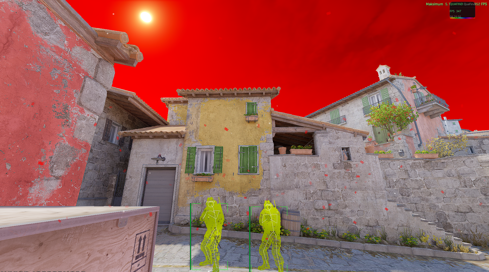

<div align="center">

# QuaFind
### CS2 Internal Cheat -- Open Source


</div>

---

## Overview

**QuaFind** is a feature-rich CS2 internal cheat written in C++17. It injects as a DLL and hooks into the DirectX 11 / DXGI rendering pipeline using **MinHook** to render an **ImGui** overlay and apply game-state modifications in real time.

> **Low pattern scanning.** We only pattern scan for the Skybox. Everything else is handled via offsets stored in a single `SDK.h` file under the `Off::` namespace. When the game updates, you just update the hex values and rebuild in minutes — no fragile byte-pattern chains to maintain everywhere else.
---

## Features

### 🎯 ESP -- Extra Sensory Perception

Full player ESP with bounding boxes (corner or outline style), names, health bars, bone skeletons, head circles, weapon icons, snap lines, and distance text. Separate colors for visible vs. occluded targets. Every element is individually toggleable.

---

### ✨ Glow


Writes to the game's internal glow render properties to draw a colored outline around enemies. Supports separate visible / occluded colors, optional team glow, and hotkey toggle.

---

### 🎨 Chams

| Material 1 | Material 2 |
|:---:|:---:|
|  |  |

Hooks `DrawIndexedInstanced` to swap player model materials at draw time. Renders enemies through walls with a distinct occluded color. Supports multiple material styles and a **Rainbow RGB** mode that continuously rotates hue. Weapon chams included.(More material is available; this is just a preview.)

| Weapon Chams |
|:---:|
|  |

---

### 🌌 Visual FX

| 3D Skybox Changer |
|:---:|
|  |

- **3D Skybox Changer** -- Hooks `DrawSkyboxArray` in `scenesystem.dll` via MinHook to recolor the actual 3D skybox with any RGB value in real time.(using pattern)
- **2D Sky Overlay** -- Gradient sky color drawn on the ImGui background layer.
- **DX11 World Tint** -- Full-screen RGBA tint applied via a custom D3D11 pixel shader injected into the pipeline.
- **Screen Fog / Vignette** -- Configurable edge fog on all four screen sides with independent RGBA controls.
- **Snow / Sakura Particles** -- 2D screen-space or full **3D world-tracked** particle system. In 3D mode, particles spawn around the player's world position, follow a wind vector, scale with depth, and fade by distance for a realistic effect.
- **No Smoke** -- Zeroes smoke grenade render properties each tick to make smokes invisible.

---

### 🖥️ Legit Aimbot

Smooth, human-like aim assist targeting the nearest enemy within a configurable FOV circle. Features: smoothing factor, bone selection (head / neck / chest / pelvis), wall-check, dead-zone, target lock, proximity lock, and team-fire protection.

---

### 💥 Ragebot

High-speed aimbot for rage play. Instant snap to target with auto-fire support and configurable fire delay.

---

### ⚡ Triggerbot

Automatically fires when an enemy is under the crosshair. Configurable delay, wall-check, team filter, and hold-key mode.

---

### 🔄 Anti-Aim

Desynchronizes the player's visual yaw from the server-side hitbox. Modes: **Static**, **Jitter**, **Slow Spin**, **Fast Spin**. Toggle via hotkey.

---

### ➕ Crosshair

Custom ImGui crosshair rendered independently of the game. Configurable size, gap, line thickness, and color.

---

### 📡 Radar Hack

Forces `m_bSpotted` and `m_bSpottedByMask` on all enemies every frame so they always appear on the minimap. Values are restored after the frame to minimize the detection surface.

---

### 🐇 Movement

| Feature | Description |
|---|---|
| **Bunny Hop** | Sub-tick aware auto-jump via `dwForceJump` writes for maximum hop consistency |
| **Auto-Strafe** | Automatically applies strafing input during air time |
| **No Flash** | Zeroes `m_flFlashDuration` on the local pawn every frame |
| **No Scope** | Blocks the `DrawScopeOverlay` hook to remove the scope lens |

---

### 💣 Grenade ESP

| Feature | Description |
|---|---|
| **Grenade Trail** | Trajectory line drawn behind live grenades |
| **Molotov Wall** | Visible boundary outline around active Molotov / inferno areas |
| **Team Color Coding** | Separate colors for T-side and CT-side grenades |

---

### 🩸 Hit Marker

Renders a `+` shaped indicator at screen center when a shot registers. Configurable color, size, line thickness, and fade duration.

---

### 📋 Overlay Panels

All panels are freely draggable in-game via a window-arrange mode:

| Panel | Description |
|---|---|
| **Spectator List** | Names of all players currently spectating the local player (dead-state + observer mode validated) |
| **Shortcut List** | Active hotkey bindings for quick in-game reference |
| **C4 / Bomb Timer** | Visual countdown for the planted bomb defuse timer |
| **Info Overlay** | FPS counter, active features summary, and cheat state HUD |

---

### 🎨 Skin Changer

| Preview 1 | Preview 2 |
|:---:|:---:|
|  |  |

**PaintKit-based skin changer** -- no model swapping. Writes directly to the weapon's attribute manager (`m_AttrMgr`) to apply:

- Any **paint kit (skin)** by numeric ID
- **Float / Wear** value (0.0 Factory New → 1.0 Battle-Scarred)
- **Pattern seed**

Writes are delayed via a `WriteSafe` timer on first pawn detection to reduce the memory-write detection window.

---

## Why Low Pattern Scanning?

Most CS2 cheats scan for byte patterns in game memory to locate functions on every launch. QuaFind uses a fundamentally different approach(except skybox):

**All offsets are hardcoded constants in `SDK.h` under the `Off::` namespace.**

When Valve pushes a game update, the workflow is:

1. Open `SDK.h`
2. Update the changed offset values (sourced from community offset dumps like CS2-Offsets)
> (For Skybox) If the patterns in scenesystem.dll have changed, find and replace them using IDA or other websites.
3. Run `build.bat`

No pattern strings to maintain, no scanner to break, no startup delay scanning megabytes of memory. Update time: a few minutes.(Skybox is excluded, but since that won't affect your game anyway, it shouldn't be a problem; even if it breaks, you can still use it without updating.)

---

## Hook Architecture

| Hook | Location | Purpose |
|---|---|---|
| `hkPresent` | `IDXGISwapChain::Present` | Main render loop -- ImGui, features, overlays |
| `hkResizeBuffers` | `IDXGISwapChain::ResizeBuffers` | Swap chain resize handling |
| `hkDrawIndexedInstanced` | `ID3D11DeviceContext` | Chams -- intercepts player model draw calls |
| `hkDrawSkyboxArray` | `scenesystem.dll` | Skybox color override -- installed lazily when enabled |

---

## Build

Requirements: **MSVC** (Visual Studio Build Tools 2022) + **Windows SDK**

```bat
build.bat
```

Output: `QuaFind.dll` -- inject into `cs2.exe` with any standard DLL injector.

(Note: Extreme injector will most likely be detected by VAC.)

(Note2:The project is in Turkish because that's how I coded it at the time and I haven't changed it since. You can change it if you want. You can easily do this using AI IDEs within the code, for example; Kiro.)

---

## Project Structure

```
src/
├── SDK.h              -- Offsets, structs, SafeRead/SafeWrite helpers
├── Features.h         -- Config namespace, bhop, aimbot, no-flash, spectator scan
├── Hooks.h            -- All hooks, ImGui menu, ESP and overlay rendering
├── VisualExtras.h     -- Sky overlay, no-smoke, particle system (snow/sakura)
├── SkinChanger.h      -- PaintKit skin changer
├── WeaponChams.h      -- Weapon-specific chams
├── ConfigSystem.h     -- Binary config save/load (.qcfg profiles)
├── Config.h           -- Legacy INI config save/load
├── HitMarker.h        -- Hit indicator system
├── BombTimer.h        -- C4 / bomb timer
├── CrashLogger.h      -- SEH crash log writer
└── build.bat          -- One-click MSVC build script
```

---

<div align="center">
<sub>QuaFind -- open source cheat</sub>
</div>
